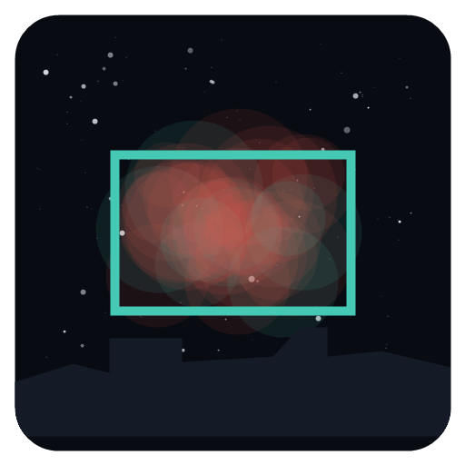

# Skyframe

Pianificatore di target per astrofotografia. Gli dai il tuo setup, i tuoi filtri e il tuo cielo; lui ti dice **cosa conviene riprendere stanotte**, con quale configurazione, quali filtri, quante ore e con che sub.



## Cosa fa

- **Cupola del cielo animata** vista dal tuo luogo: stelle reali fino a mag 6, Via Lattea che si spegne con l'inquinamento luminoso e con la Luna, il tuo orizzonte, la Luna con la fase, i target migliori. Puoi scorrere la notte o trascinare l'ora; il livello *Luci* mostra la luminosità del cielo per direzione.
- **Catalogo di 2.365 oggetti**, non solo i soliti: Messier, NGC/IC, Sharpless, Lynds e Barnard (nebulose oscure), van den Bergh (riflessione), planetarie deboli (Abell…), resti di supernova visibili in ottico, gruppi di galassie. Filtri per tipo, catalogo, dimensione, tecnica, ore utili, notti necessarie, luminosità superficiale, costellazione, “nascondi i classici”.
- **Profili** con camera, ottica, **accessori** (correttore di coma 0,9×, riduttori, Barlow…) e **filtri reali** scelti da un database con le bande dichiarate dai produttori (Optolong, Antlia, Askar, IDAS, STC, ZWO, Player One, Baader, Astronomik, Chroma…). Ogni accessorio è una configurazione: per ogni target Skyframe dice quale conviene, e confronta anche gli altri profili nello stesso luogo.
- **Luogo** scelto su mappa (ricerca mentre scrivi, spillo trascinabile, atlante dell'inquinamento sovrapposto) con altitudine automatica. SQM allo zenit e **luminosità del cielo per direzione** dall'atlante di David Lorenz 2025.
- **Piano di ripresa** per ogni target: una strategia sola (non “usa tutti i filtri”), per esempio *L-eXtreme 12 h (sub 600 s) + UV/IR 1,5 h per le stelle*, oppure *banda stretta per l'emissione + banda larga per le polveri*. Tempo **base** e tempo **profondo** (con l'Hα diffuso misurato attorno all'oggetto), costo della Luna di stanotte, prossime notti buie, alternative.
- **Inquadratura**: anteprima con foto reale DSS2 e sensore in scala, **rotazione e centro migliori** (per esempio la Cocoon spostata di 42′ verso B 168), mosaici, consigli concreti.

## Scaricare

Dalla pagina [Releases](https://github.com/astropuzzo/skyframe/releases):

| Sistema | File |
| --- | --- |
| Windows | `Skyframe-…-setup.exe` (installer) oppure `Skyframe-…-portable.exe` |
| macOS (Intel e Apple Silicon) | `.dmg` |
| Linux | `.AppImage` oppure `.deb` |

Le build non sono firmate: su Windows SmartScreen chiede conferma (*Ulteriori informazioni → Esegui comunque*), su macOS la prima volta apri l'app con clic destro → *Apri*.

## Sviluppo

```bash
npm install
npm start          # avvia l'app
npm run check      # stampa i piani di ripresa di alcuni scenari di riferimento
npm run smoke      # avvia l'app senza finestra, apre dettaglio ed editor e salva screenshot
npm run data       # ricostruisce src/data/ dai cataloghi originali (scarica ciò che manca in scripts/raw/)
npm run dist       # crea i pacchetti per il sistema corrente in dist/
```

GitHub Actions compila Windows, macOS e Linux a ogni push su `main`; con un tag `v*` pubblica una release.

## Come vengono stimati i tempi

Per ogni filtro si usano le sue bande reali. Per ogni banda si calcola quanta luce dell'oggetto passa (continuo più le righe Hα, [NII], Hβ, OIII, SII, pesate dalla risposta dei pixel R/G/B se la camera è a colori) e quanto fondo cielo: SQM del luogo per direzione (continuo tipo LED più righe di mercurio e sodio), luminescenza naturale, Luna ogni 5 minuti, estinzione ridotta con l'altitudine.

La qualità è un SNR per elemento di risoluzione (il più grande tra pixel e 2″, la scala del seeing) su tre livelli: luminosità media dell'oggetto, parti deboli (aloni, bracci esterni) e polveri estese attorno (LS ≥ 25). Il tempo profondo aggiunge l'Hα diffuso attorno all'oggetto misurato nella mappa all-sky di Finkbeiner.

Riferimenti di taratura: M31 con RedCat 51 e OSC sotto SQM 18,6–19,3 → 10–18 h; NGC 7000 con L-eXtreme → 7–12 h; Cocoon (IC 5146 + B 168) con 800 mm f/5 OSC e SQM 19,3 → 56 h base, 95 h profondo, contro le 100 h di un'immagine reale. Sono stime per scegliere, non promesse.

## Dove finiscono i dati

I profili sono in `profili.json` nella cartella dati dell'app (`%APPDATA%\Skyframe` su Windows, `~/Library/Application Support/Skyframe` su macOS, `~/.config/Skyframe` su Linux) e si possono esportare/importare in JSON. Le tile dell'atlante scaricate restano in cache nella stessa cartella.

## Fonti dei dati e licenze

| Dati | Fonte | Licenza / citazione |
| --- | --- | --- |
| NGC/IC, Messier, soprannomi | [OpenNGC](https://github.com/mattiaverga/OpenNGC) (Mattia Verga) | CC-BY-SA 4.0 — per questo `src/data/dso.js` è distribuito sotto CC-BY-SA 4.0 |
| Sharpless, Lynds, Barnard, van den Bergh, planetarie, resti di supernova | VizieR: VII/20, VII/7A, VII/220A, VII/21, V/84, VII/297 (Green) | citare i cataloghi originali |
| Hα diffuso | Finkbeiner 2003, ApJS 146, 407 (WHAM + VTSS + SHASSA), da [NASA LAMBDA](https://lambda.gsfc.nasa.gov/product/foreground/fg_halpha_get.html) | dati pubblici NASA |
| Inquinamento luminoso | [Atlante di David Lorenz](https://djlorenz.github.io/astronomy/lp/) (VIIRS 2025) | scaricato al bisogno, non ridistribuito |
| Stelle, costellazioni, Via Lattea | [d3-celestial](https://github.com/ofrohn/d3-celestial) (Olaf Frohn) | BSD-3-Clause |
| Foto del campo | DSS2 via CDS hips2fits / NASA SkyView | uso online |
| Mappa, ricerca, altitudine | OpenStreetMap, Photon (komoot), Open-Meteo | ODbL / servizi pubblici |
| Mappa interattiva | [Leaflet](https://leafletjs.com) | BSD-2-Clause (`src/vendor/leaflet/LICENSE`) |
| Filtri | schede dei produttori (link a ogni filtro in `src/data/filters.js`) | — |
| Caratteri | IBM Plex Sans/Mono, Saira Condensed (Google Fonts) | SIL Open Font License 1.1 |

Codice: MIT.
