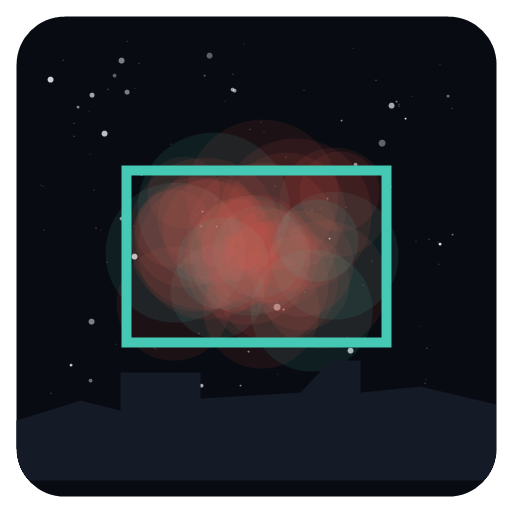

# Skyframe

Pianificatore di target per astrofotografia. Gli dai il tuo setup, i tuoi filtri e il tuo cielo; lui ti dice **cosa conviene riprendere stanotte**, con quale configurazione, quali filtri, quante ore e con che sub.



## Cosa fa

- **Guida passo passo** al primo avvio, con il riquadro illuminato su ogni funzione e il logo animato; si riprende da *Setup → Guida*, e a ogni aggiornamento con funzioni nuove le **Novità** propongono un giro solo di quelle.
- **Movimento dove aiuta a capire**: le sezioni entrano dal lato verso cui vai, le strisce delle notti si disegnano, i calendari compaiono in sequenza, i numeri salgono al valore; tutto spento se il sistema chiede di ridurre le animazioni.
- **Cinque sezioni**: *Stanotte* (la notte scelta in poche righe, la cupola, il piano e i migliori target), *Target* (tutto il catalogo con ricerca e filtri), *Cielo* (il meteo astronomico), *Progetti* (i tuoi preferiti e quello che stai riprendendo) e *Setup* (attrezzatura, luoghi, avvisi, lingua, dati). Sul telefono la barra delle sezioni sta in basso, i filtri e le scelte si aprono in fogli dal basso, il dettaglio di un target si chiude trascinandolo giù o col tasto indietro.
- **Le prossime 14 notti** in una striscia: fase della Luna, meteo previsto e un voto per ognuna (ore buone: sereno senza Luna, più un terzo del sereno con la Luna); si tocca una notte e l'app ci va. Per le date più lontane un calendario del mese con la fase della Luna di ogni sera.
- **Cupola del cielo animata e grande**, con i target sotto, vista dal tuo luogo: stelle reali fino a mag 6, Via Lattea che si spegne con l'inquinamento luminoso e con la Luna, il tuo orizzonte, la Luna con la fase, i target migliori. Puoi scorrere la notte o trascinare l'ora; il livello *Luci* mostra la luminosità del cielo per direzione.
- **Catalogo di 2.366 oggetti**, non solo i soliti: Messier, NGC/IC, Sharpless, Lynds e Barnard (nebulose oscure), van den Bergh (riflessione), planetarie deboli (Abell…), resti di supernova visibili in ottico, gruppi di galassie. Filtri per tipo, catalogo, dimensione, tecnica, ore utili, notti necessarie, luminosità superficiale, costellazione, “nascondi i classici”.
- **Profili** con una camera, **più telescopi** e i **filtri reali** che possiedi (database con le bande dichiarate dai produttori: Optolong, Antlia, Askar, IDAS, STC, ZWO, Player One, Baader, Astronomik, Chroma…). Ogni telescopio ha i suoi **accessori** (correttori di coma, riduttori, spianatori, Barlow) e l'editor propone solo quelli adatti alla sua famiglia: Newton, rifrattore, SCT, RC. Ogni combinazione telescopio + accessorio è una configurazione: per ogni target Skyframe sceglie la migliore **fra quelle del profilo attivo** e la mostra nella lista, dove puoi anche filtrare i target per setup. Ottiche da catalogo raggruppate per marca, tra cui tutta la gamma TS-Optics (ONTC/UNC, Hypergraph, Astrograph, Photon, RC, Photoline), Lacerta, Sky-Watcher, Takahashi, William Optics, Askar, Celestron.
- **Luogo** scelto su mappa (ricerca mentre scrivi, spillo trascinabile, atlante dell'inquinamento sovrapposto) con altitudine automatica.
- **Più luoghi di ripresa**, separati dai profili: ognuno ha il suo cielo (SQM, atlante, mappa all-sky), il suo orizzonte e la sua altezza minima, e si cambia dalla barra in alto. Mentre guardi il luogo attivo, Skyframe calcola in sottofondo gli stessi target, con lo stesso profilo e la stessa notte, negli altri luoghi salvati: nella lista compare il luogo dove un target costa molto meno tempo (o dove si riprende, se da qui no), il pannello *Luoghi a confronto* dice quanto è più rapido ogni luogo sui primi target, e nel dettaglio *Dove conviene* mette a confronto cielo sul target, ore libere, tempo e setup di ogni luogo. Si può anche ordinare la lista per *Più rapidi in un altro luogo*.

- **Luminosità del cielo per direzione** dalla mappa *All-sky* di [lightpollutionmap.info](https://www.lightpollutionmap.info): quando fissi il punto, Skyframe apre il sito in una finestra nascosta e fa quello che faresti tu (punto sulla mappa, livello Sky brightness dell'anno, pulsante *All-sky*), poi legge l'immagine che il sito genera: barra dei colori, orizzonte e terreno, magnitudine per ogni direzione. Il terreno dell'immagine diventa l'orizzonte del luogo e si aggiorna quando cambia la mappa; se l'orizzonte lo disegni o lo importi tu, la mappa lo alza soltanto dove il terreno è più alto. La stessa immagine si può anche trascinare a mano nell'editor. Senza rete, o finché non arriva, si usa una stima dall'atlante di David Lorenz 2025.
- **Quanto ci vuole**, per ogni target, in una scheda: le ore di posa col cielo senza Luna (il minimo) e, per i tre modi di riprendere — *consigliato* (salta le notti con troppa Luna), *tutte le sere* (anche con la Luna piena), *solo senza Luna* — e per ogni altro luogo salvato, le ore da raccogliere davvero, le notti, il giorno in cui finisci e una striscia dei giorni che mostra quali notti si usano. Con la Luna ogni ora rende meno: tutte le sere finisci prima ma raccogli più ore, aspettando il buio ne bastano meno. Il modo scelto vale in tutta l'app (anche in *Setup*). La scheda *Quando* mostra le stesse notti in un calendario di sei settimane: ore utili, Luna, meteo e quanto lavoro fa ogni notte; si tocca una notte per aprirla.
- **Piano di ripresa** per ogni target: una strategia sola (non “usa tutti i filtri”), per esempio *L-eXtreme 12 h (sub 600 s) + UV/IR 1,5 h per le stelle*, oppure *banda stretta per l'emissione + banda larga per le polveri*. Tempo **base** e tempo **profondo** (con l'Hα diffuso misurato attorno all'oggetto), costo della Luna di stanotte, prossime notti buie, alternative.
- **Preferiti e progetti**: una stella su ogni target, il filtro *I miei* che mostra solo i tuoi (anche quelli che stanotte non si riprendono) e, nel dettaglio, il tuo progetto: registri le notti fatte (ore, filtri, luogo) e Skyframe tiene il conto del lavoro, dice quanto manca e ricalcola le notti a partire da lì. Ogni sessione vale per quello che valeva sotto quel cielo: un'ora da un sito buio pesa più di un'ora dal terrazzo, e un'ora con la Luna piena meno di un'ora senza. Quando hai finito lo segni come fatto, e puoi nascondere i target già fatti. La sezione *Progetti* li raccoglie con miniatura, avanzamento e ore che mancano, e li mette **tutti insieme**:
  - **piano di stagione**: le prossime 90 notti divise fra i tuoi target come faresti tu (ogni notte ai target che lì rendono di più rispetto alla loro notte migliore del mese, con una spinta a chi sta per uscire di stagione e a chi è in corso; una notte si divide quando più target la vogliono): per ognuno quando finisci e con quante notti, e quando finisci tutto;
  - **calendario** a cinque settimane con, in ogni notte, le miniature dei target da riprendere (si vedono le sovrapposizioni); si tocca una notte per vedere chi e per quante ore, e aprirla;
  - **le stagioni**: una riga per target e una casella per settimana dei prossimi 12 mesi, più accesa quando rende di più, con le Lune nuove.
- **Meteo astronomico** (sezione *Cielo*), tutto da [Open-Meteo](https://open-meteo.com):
  - nuvole basse, medie e alte da **sette modelli** insieme (ItaliaMeteo ICON-2I a 2 km per l'Italia, DWD ICON-D2, Météo-France, ECMWF, DWD ICON, UK Met Office, NOAA GFS), in una media che dà più peso all'alta risoluzione, e quanto i modelli sono **d'accordo**; una tabella li mette uno sopra l'altro ora per ora;
  - **probabilità di sereno** dai 51 scenari dell'ensemble ECMWF;
  - **seeing** stimato dalla turbolenza nei livelli in quota di GFS ed ECMWF (modello di Dewan, come Trinquet e Vernin 2006), in secondi d'arco alla scala di meteoblue: su 30 ore di confronto a Milano la correlazione con i loro valori è 0,85; più la corrente a getto;
  - **trasparenza** dagli aerosol e dalle polveri desertiche di CAMS (Copernicus), **rischio condensa** (punto di rugiada), raffiche e pioggia;
  - le prossime notti in schede con voto e sereno ora per ora, la notte scelta come una tabella da osservatorio, gli altri tuoi luoghi (dove è sereno stanotte).
  Il calendario delle notti e il piano contano solo le ore serene previste, pesate per la trasparenza (con molti aerosol un'ora rende meno); il voto delle notti tiene conto anche della trasparenza.
- **Piano di stanotte**: i tuoi target messi in fila nelle ore buie e serene, ognuno quando è più alto rispetto al suo percorso, con blocchi di almeno 45 minuti; chi sta per tramontare passa prima e chi ha finito il suo lavoro lascia il posto. Si corregge a mano: togli un target dal piano, o aggiungine uno dal suo dettaglio; a notte iniziata ogni blocco si registra come sessione con un tocco.
- **Avvisi** (da *Setup*, uno per uno):
  - **Stasera si scatta**: prima del buio (30 minuti – 2 ore, a scelta), se la notte arriva al voto che scegli e il piano ha posto per i tuoi target: finestra serena, probabilità, target con gli orari, seeing, rischio condensa e raffiche;
  - **Notte ottima in arrivo**: il giorno prima, per una notte dei prossimi tre giorni senza Luna e serena con buona probabilità, con i target che le assegna il piano di stagione;
  - **Il meteo è cambiato**: stanotte si apre, o le nuvole tornano dopo l'avviso;
  - **Ultime settimane**: un tuo target sta per uscire di stagione e il lavoro non è finito.
  Su Android arrivano ad app chiusa, e uno script in background ([Background Runner](https://github.com/ionic-team/capacitor-background-runner), senza permessi di posizione) riscarica le nuvole ogni 15–30 minuti: l'avviso della sera parte con la previsione più fresca. Alcuni telefoni fermano le attività in background per risparmiare batteria: in quel caso gli avvisi restano quelli programmati all'ultima apertura dell'app. Sul computer arrivano con l'app aperta.
- **Periodo giusto** per ogni target, anche se stanotte non è il momento: da quando a quando conviene, il picco di ore per notte e la prima notte senza Luna, con un clic per aprirla. Grafici della notte e dei 12 mesi interattivi: passa sopra per leggere, clicca per spostare l'ora o aprire la notte più buia del mese.
- **Il target a colpo d'occhio**: in cima al dettaglio l'immagine del target da diverse survey (NSNS a colori, che a grande campo somiglia a una foto amatoriale, DSS2, Pan-STARRS, Hα) con + e − per allargare, e le foto con licenza libera di Wikimedia Commons, prima quelle degli astrofili, con autore e licenza; a tutto schermo con un tocco. In fondo alla striscia, il collegamento alle foto di AstroBin.
- **Inquadratura**: anteprima con foto reale e sensore in scala, **rotazione e centro migliori** (per esempio la Cocoon spostata di 42′ verso B 168), mosaici, consigli concreti.
- **Aggiornamenti automatici**: all'avvio e ogni 6 ore Skyframe controlla le release. Con l'installer di Windows e con l'AppImage scarica la nuova versione, la installa e si riapre (subito dal banner, o da solo alla chiusura). Con macOS, l'exe portable e il `.deb` avvisa e porta alla pagina della release.

- **Lingue**: italiano e inglese (scelta in *Setup*, di default quella del sistema). Ogni lingua è un dizionario in `src/i18n/`: per aggiungerne una basta un file nuovo.

## Scaricare

Dalla pagina [Releases](https://github.com/astropuzzo/skyframe/releases):

| Sistema | File |
| --- | --- |
| Windows | `Skyframe-…-setup.exe` (installer) oppure `Skyframe-…-portable.exe` |
| macOS (Intel e Apple Silicon) | `.dmg` |
| Linux | `.AppImage` oppure `.deb` |
| Android (7.0 o più recente) | `Skyframe-…-android.apk`: aprilo dal telefono e consenti l'installazione da questa fonte |

Le build non sono firmate: su Windows SmartScreen chiede conferma (*Ulteriori informazioni → Esegui comunque*), su macOS la prima volta apri l'app con clic destro → *Apri*.

Sull'app Android la mappa all-sky di lightpollutionmap non si scarica da sola: esporta profili e luoghi dal desktop (con le mappe già lette) e importali sul telefono, oppure importa l'immagine a mano. Quando esce una versione nuova l'app lo segnala e apre il download dell'APK.

## Sviluppo

```bash
npm install
npm start          # avvia l'app
npm run check      # stampa i piani di ripresa di alcuni scenari di riferimento
node scripts/calibrate.cjs   # confronta il modello con le foto reali (dati in scripts/raw/, non nel repository)
npm run smoke      # avvia l'app senza finestra: dettaglio, editor, mappa all-sky su Roma; salva screenshot
npm run data       # ricostruisce src/data/ dai cataloghi originali (scarica ciò che manca in scripts/raw/)
npm run dist       # crea i pacchetti per il sistema corrente in dist/
npm run android:sync   # copia l'app nel progetto Android (android/), poi si compila con Gradle o Android Studio
# prova su Android vero (emulatore Android 14 su GitHub Actions): workflow «Android e2e», schermate e avvisi negli artifact
npx electron scripts/icons.cjs   # rigenera tutte le icone (desktop, Android, avvio) da build/icon.svg
```

GitHub Actions compila Windows, macOS e Linux a ogni push su `main`; con un tag `v*` pubblica una release, insieme ai file `latest*.yml` che servono agli aggiornamenti automatici. Per pubblicare: alza `version` in `package.json`, poi `git tag vX.Y.Z && git push --tags`.

## Come vengono stimati i tempi

Per ogni filtro si usano le sue bande reali. Per ogni banda si calcola quanta luce dell'oggetto passa (continuo più le righe Hα, [NII], Hβ, OIII, SII, pesate dalla risposta dei pixel R/G/B se la camera è a colori) e quanto fondo cielo: SQM del luogo per direzione (continuo tipo LED più righe di mercurio e sodio), luminescenza naturale, Luna ogni 5 minuti, estinzione ridotta con l'altitudine.

La qualità è un SNR per elemento di risoluzione su tre livelli: il corpo dell'oggetto, le parti deboli (aloni, bracci esterni) e le polveri estese attorno (LS ≥ 26,5). L'elemento è proporzionale al diametro, 4 volte il limite di diffrazione (2,3″ a 200 mm, 4,7″ a 100 mm, o il pixel se è più grande): ogni telescopio si guarda al dettaglio che sa dare. Lo SNR richiesto cresce con la luminosità superficiale e scende piano con la dimensione: sugli oggetti luminosi e piccoli si pretende più pulizia, su quelli deboli e grandi si accetta più rumore. Per le nebulose a emissione il corpo viene dall'Hα misurato nell'oggetto (NSNS e SHASSA, in Rayleigh; mediana dell'ellisse, 75° percentile nei resti di supernova che sono filamenti), non dalla magnitudine di catalogo, che per molte nebulose è 2–10 volte troppo luminosa. Le polveri si riconoscono in due modi: una nube oscura grande dei cataloghi collegata all'oggetto (B 168 per la Cocoon), oppure la polvere misurata attorno all'oggetto nella mappa di Schlegel, Finkbeiner & Davis (1998), che vede anche le nubi spezzate in tanti pezzi piccoli (NGC 1333, Iris, M 78, Sh2-136). Nel dettaglio i consigli dicono anche quanto basterebbe per la sola parte luminosa. Il tempo profondo aggiunge l'Hα diffuso attorno all'oggetto misurato nella mappa all-sky di Finkbeiner.

Le bolle di Wolf-Rayet (NGC 6888, WR 134, NGC 2359, Sh2-308) hanno un profilo di righe proprio, con OIII forte, e un guscio esterno quasi solo in OIII, molto più debole dei filamenti in Hα. Quando due multibanda lasciano passare la stessa riga (L-eXtreme e L-Synergy con l'OIII) i due segnali si sommano, e le ore si dividono tra i due filtri.

### Taratura e verifica

La descrizione completa (variabili usate e ignorate, relazioni fisiche, evidenze, ipotesi, verifiche, limiti e dati che servono) è in [docs/MODELLO.md](docs/MODELLO.md); i casi rappresentativi in [docs/VERIFICA-casi.md](docs/VERIFICA-casi.md); la copertura del catalogo in [docs/CATALOGO.md](docs/CATALOGO.md).

In breve:

- **Fisica.** Il tempo per un SNR dato segue il rumore fotonico: t ∝ SNR² × (segnale + fondo + rumore di lettura) / segnale². Filtri, cielo, telescopio e Luna cambiano il tempo solo così.
- **Livello di qualità, dalle foto.** Su 2054 foto AstroBin a colori da cieli Bortle 6–8 (259 oggetti), ognuna rifatta con la sua attrezzatura e il suo cielo, il livello «buona» di un oggetto è il SNR della sua foto mediana; per gli oggetti senza foto si prevede dalla difficoltà fisica (log g = 0,02 − 0,71 · log D): sugli oggetti difficili si accetta un SNR più basso. `node scripts/quality-fit.cjs` rifà l'adattamento e scrive `src/data/quality.js`.
- **Verifica fuori campione** su 743 foto di 161 oggetti mai usati per tarare: errore mediano sull'oggetto ×1,60, 65% degli oggetti entro un fattore 2 (0.15: ×4,07 e 26%).
- **Sensore e Luna.** La risposta spettrale del sensore è quella misurata in laboratorio sui sensori Sony retroilluminati (Hα e SII rendono circa il 55% dell'OIII). Con la Luna della notte si ricalcola la combinazione più rapida e, se riduce il tempo di almeno il 15%, la si propone.
- **Pose singole**: in banda larga 60 s sotto f/3, altrimenti 120–300 s; con i duo-band 300 s: i valori più usati nelle foto, mai sotto il minimo fisico.

Strumenti: `node scripts/astrobin-dataset.cjs` (foto → righe con l'attrezzatura riconosciuta da `scripts/gear.cjs`), `node scripts/calibrate.cjs` (confronto modello–foto; `CAL_SET=taratura|verifica`, `CAL_MODEL=` un altro model.js), `node scripts/check-cases.cjs` (casi rappresentativi), `node scripts/build-index.cjs` (indice del catalogo e rapporto di copertura). I file delle foto restano in `scripts/raw/`, fuori dal repository; nel repository ci sono solo metodo e risultati aggregati.

Riferimenti dell'autore (terrazzo, SQM ~19,3, 800 mm f/5, camera a colori, L-eXtreme + L-Synergy): Cocoon ~100 h e WR 134 ~95 h per un SNR ritenuto discreto. Il livello «buona» dà 4,4 h e 6,2 h, «profonda» 14,5 h e 20,5 h: lo standard dell'autore è sopra il 90° percentile delle foto apprezzate.

Nelle galassie la parte principale è il corpo (0,5 mag sopra la media di catalogo). Le righe deboli (SII in una nebulosa a emissione, Hα in una planetaria) si accettano più rumorose, in proporzione alla loro intensità. La **combinazione di filtri** consigliata è quella con il tempo più breve per il SNR richiesto, fra quelle ammesse dall'obiettivo del profilo (minor tempo, tutte le righe, colori naturali), senza pesi: sugli oggetti a righe deve raccogliere Hα e OIII quando sono importanti. Con la banda stretta il colore delle stelle viene da una ripresa a banda larga separata di 20 pose.

Sono stime per scegliere, non promesse.

Il **punteggio** della lista combina l'inquadratura (quanto l'oggetto riempie il campo, o se serve un mosaico), le ore libere col buio stanotte, l'impegno (quante notti servono) e l'interesse fotografico: a parità del resto una nebulosa vale più di un ammasso aperto, che si fa in un'ora ma raramente è il soggetto di una foto (nebulose e resti di supernova 1, planetarie e galassie 0,9, nebulose oscure 0,8, ammassi globulari 0,7, aperti 0,45; ×0,85 per gli oggetti senza un nome proprio e fuori dai classici).

Le **pose singole** in banda larga: oltre il minimo che copre il rumore di lettura (pochi secondi sotto un cielo cittadino) l'SNR finale dipende solo dal tempo totale, quindi decide quanto reggono le stelle. In ogni telescopio puoi scrivere la posa più lunga che usi in banda larga senza saturare: Skyframe la propone (scalata col quadrato del fattore di riduttori e Barlow); se il campo è vuoto propone il minimo della fascia pratica del filtro.

**Senza Luna e con la Luna sono due numeri diversi.** Il tempo di posa mostrato per ogni target è quello senza Luna lungo il suo percorso reale nella notte scelta (altezza, estinzione, cielo e luci nella sua direzione a ogni passo di 5 minuti): è quanto chiede il target sotto quel cielo, e si confronta fra luoghi e filtri. Con lo stesso profilo (200/800, camera a colori, due duo-band), un terrazzo di città (SQM 19,25) contro un sito a SQM 21,3: la Cocoon passa da 4,2 a 1,5 h, NGC 281 da 2,1 a 1,0 h (livello «buona»). Quanto costerebbe con la Luna della notte scelta è indicato a parte (con la Luna piena i due cieli si somigliano: ×1,3). Nel profilo si sceglie se il calendario delle notti usa anche le notti con la Luna, col loro rallentamento, o solo le ore senza Luna.

Le **notti di ripresa** non sono le ore divise per le ore di stanotte: Skyframe scorre le notti una per una, da quella scelta in avanti (fino a un anno), e per ognuna calcola quante ore il target è libero sopra orizzonte e altezza minima col buio, e quanto rende in quelle ore con la Luna, l'altezza e il cielo di quella notte. Somma il lavoro fatto finché basta. Le notti in cui il target rende più di 2,5 volte meno che nella notte migliore del mese (di solito per la Luna) si saltano, perché conviene dedicarle ad altro. Si assume il cielo sempre sereno. Nel dettaglio un grafico mostra le notti usate, quelle saltate e quando finisci (anche per il tempo profondo).

## Dove finiscono i dati

Profili e luoghi sono in `profili.json` nella cartella dati dell'app (`%APPDATA%\Skyframe` su Windows, `~/Library/Application Support/Skyframe` su macOS, `~/.config/Skyframe` su Linux) e si possono esportare/importare in JSON. Le tile dell'atlante scaricate restano in cache nella stessa cartella.

## Fonti dei dati e licenze

| Dati | Fonte | Licenza / citazione |
| --- | --- | --- |
| NGC/IC, Messier, soprannomi | [OpenNGC](https://github.com/mattiaverga/OpenNGC) (Mattia Verga) | CC-BY-SA 4.0 — per questo `src/data/dso.js` è distribuito sotto CC-BY-SA 4.0 |
| Sharpless, Lynds, Barnard, van den Bergh, planetarie, resti di supernova | VizieR: VII/20, VII/7A, VII/220A, VII/21, V/84, VII/297 (Green) | citare i cataloghi originali |
| Hα diffuso | Finkbeiner 2003, ApJS 146, 407 (WHAM + VTSS + SHASSA), da [NASA LAMBDA](https://lambda.gsfc.nasa.gov/product/foreground/fg_halpha_get.html) | dati pubblici NASA |
| Polveri attorno ai target | Schlegel, Finkbeiner & Davis 1998, ApJ 500, 525 (E(B−V) da IRAS/DIRBE), da [NASA LAMBDA](https://lambda.gsfc.nasa.gov/product/foreground/fg_sfd_get.html) | dati pubblici NASA |
| Cielo per direzione | Mappa *All-sky* di [lightpollutionmap.info](https://www.lightpollutionmap.info) (Jurij Stare), dati VIIRS | letta dal sito su richiesta per il tuo punto, non ridistribuita |
| Inquinamento luminoso | [Atlante di David Lorenz](https://djlorenz.github.io/astronomy/lp/) (VIIRS 2025) | scaricato al bisogno, non ridistribuito |
| Stelle, costellazioni, Via Lattea | [d3-celestial](https://github.com/ofrohn/d3-celestial) (Olaf Frohn) | BSD-3-Clause |
| Immagini del target | DSS2, Pan-STARRS1 via [CDS hips2fits](https://alasky.cds.unistra.fr/hips-image-services/hips2fits) / NASA SkyView | uso online |
| Immagini a grande campo e Hα | [Northern Sky Narrowband Survey](http://www.simg.de/nebulae3/dr0_1), Stefan Ziegenbalg, via CDS hips2fits | CC BY-NC-SA 4.0 |
| Foto degli astrofili e degli osservatori | [Wikimedia Commons](https://commons.wikimedia.org), cercate per nome del target | licenza e autore di ogni foto, mostrati nell'app |
| Mappa, ricerca, altitudine | OpenStreetMap, Photon (komoot), Open-Meteo | ODbL / servizi pubblici |
| Mappa interattiva | [Leaflet](https://leafletjs.com) | BSD-2-Clause (`src/vendor/leaflet/LICENSE`) |
| Filtri | schede dei produttori (link a ogni filtro in `src/data/filters.js`) | — |
| Caratteri | IBM Plex Sans/Mono, Saira Condensed (Google Fonts) | SIL Open Font License 1.1 |

Codice: MIT.
